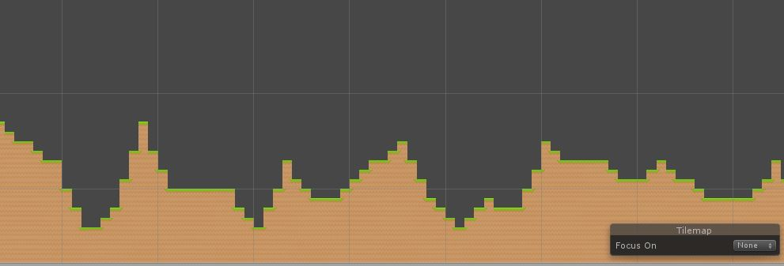

# MAPA 2D PROCEDURAL

_Este repositorio contiene algunos algoritmos para crear un mapa 2D procedural_

## Algoritmos

_Perlin Noise_

Este algoritmo permite generar terrenos haciendo el uso del ruido Perlin, el resultado nos da una crestas altas, útiles para simular elevaciones de terreno pero que no se sienten del todo naturales.

)

_Perlin Noise Suavizado_

Hace uso del algoritmo anterior pero crea un terreno más natural ya que el algoritmo se aplica por intervalos y no por cada uno de los bloques

