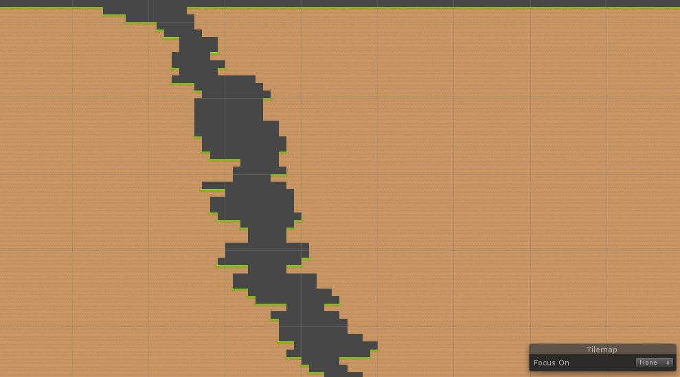
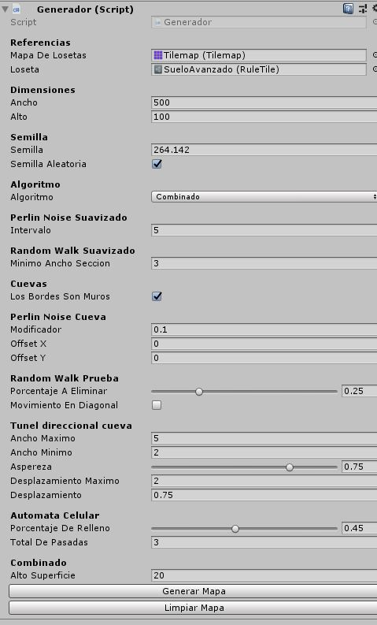

# MAPA 2D PROCEDURAL

_Este repositorio contiene algunos algoritmos para crear un mapa 2D procedural_

## Algoritmos

_Perlin Noise_

Este algoritmo permite generar terrenos haciendo el uso del ruido Perlin, el resultado nos da una crestas altas, útiles para simular elevaciones de terreno pero que no se sienten del todo naturales.

_Perlin Noise Suavizado_

Hace uso del algoritmo anterior pero crea un terreno más natural ya que el algoritmo se aplica por intervalos y no por cada uno de los bloques.

_Random Walk_

Algoritmo que permite que los desniveles no varien por más de un bloque, no hace uso de algún tipo de ruido sino que varia su camino gracias a el método Random de C#.

_Random Walk Suavizado_

Igual comportamiento del algoritmo anterior pero ahora debe esperar cierto número de bloques antes de cambiar de nivel, provoca terrenos más planos si el intervalo es muy grande

_Perlin Noise Cueva_

Generador de cuevas haciendo uso del ruido Perlin

_Random Walk Cueva_

Generador de cuevas haciendo uso del algoritmo Random Walk, las cuevas no parecen naturales pero dan una sensación de estallido dentro de ellas.

_Túnel Direccional_

Algoritmo que crea un tuner desde la superficie del mapa.

_Autómata Celular Moore_

Este generador hace uso del autómata celular de Moore, el resultado crea cuevas más naturales y agradables a la vista.

_Autómata Celular Moore_

Este generador hace uso del autómata celular de Moore, el resultado crea cuevas más naturales y agradables a la vista.

_Autómata Celular Von Neumann_

Este generador hace uso del autómata celular de Von Neumann, el resultado crea cuevas con un estilo pixelado o cuadrado.

_Combinado_

Conjunto de los algoritmos anteriores para crear un mapa completo.

## Para utilizar

Para modificar el proyecto es necesario contar con la versión de Unity 2018.4 o superior

Los Script principales se encuentran en:

Assets\Scripts\Generador.cs
Assets\Scripts\Metodos.cs

Para simular el comportamineto de los algoritmos con el proyecto de Unity ya abierto dar click en el objeto generador de la escena y en el inspector modificar los parámetros. Existen botones tanto para generar como para limpiar el mapa.

## Créditos

Para crear este programa me he basado en el blog oficial de Unity "Procedural patterns you can use with Tilemaps" y Academia de Videojuegos

https://blogs.unity3d.com/2018/05/29/procedural-patterns-you-can-use-with-tilemaps-part-i/